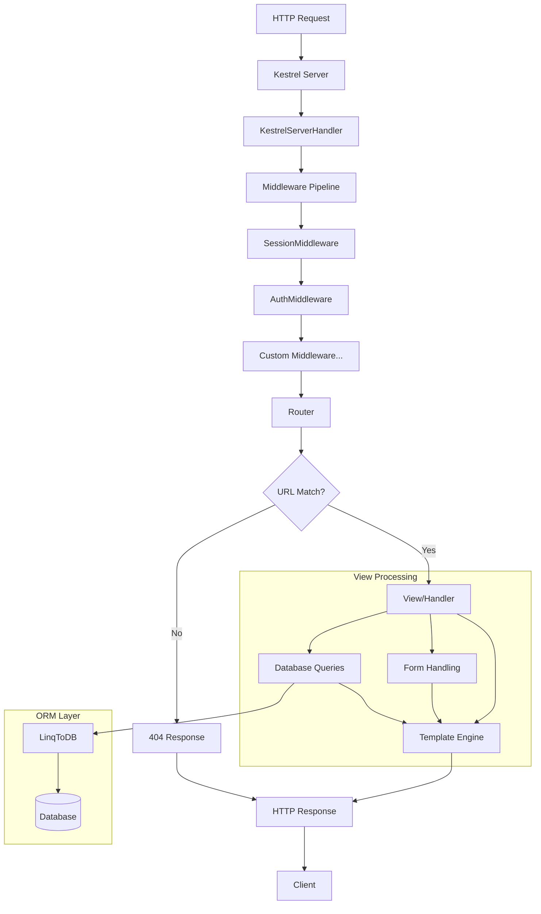

<div align="center">

```
███████╗███████╗██╗███╗   ██╗████████╗
██╔════╝██╔════╝██║████╗  ██║╚══██╔══╝
█████╗  █████╗  ██║██╔██╗ ██║   ██║
██╔══╝  ██╔══╝  ██║██║╚██╗██║   ██║
██║     ███████╗██║██║ ╚████║   ██║
╚═╝     ╚══════╝╚═╝╚═╝  ╚═══╝   ╚═╝
        ███████╗██████╗  █████╗ ███╗   ███╗███████╗██╗    ██╗ ██████╗ ██████╗ ██╗  ██╗
        ██╔════╝██╔══██╗██╔══██╗████╗ ████║██╔════╝██║    ██║██╔═══██╗██╔══██╗██║ ██╔╝
        █████╗  ██████╔╝███████║██╔████╔██║█████╗  ██║ █╗ ██║██║   ██║██████╔╝█████╔╝
        ██╔══╝  ██╔══██╗██╔══██║██║╚██╔╝██║██╔══╝  ██║███╗██║██║   ██║██╔══██╗██╔═██╗
        ██║     ██║  ██║██║  ██║██║ ╚═╝ ██║███████╗╚███╔███╔╝╚██████╔╝██║  ██║██║  ██╗
        ╚═╝     ╚═╝  ╚═╝╚═╝  ╚═╝╚═╝     ╚═╝╚══════╝ ╚══╝╚══╝  ╚═════╝ ╚═╝  ╚═╝╚═╝  ╚═╝
```

### Django-inspired Web Framework for .NET

[](https://dotnet.microsoft.com/)
[](https://docs.microsoft.com/en-us/dotnet/csharp/)
[](LICENSE)
[](https://www.sqlite.org/)

**Build web applications rapidly with familiar Django patterns in C#**

[Features](#features) · [Quick Start](#quick-start) · [Documentation](#documentation) · [Examples](#example-application) · [Contributing](#contributing)

</div>

---

## Table of Contents

- [Features](#features)
- [Quick Start](#quick-start)
- [Documentation](#documentation)
  - [Installation](#installation)
  - [Project Structure](#project-structure)
  - [Configuration](#configuration)
  - [Routing](#routing)
  - [Views](#views)
  - [Templates](#templates)
  - [Models & ORM](#models--orm)
  - [Migrations](#migrations)
  - [Forms](#forms)
  - [Admin Panel](#admin-panel)
  - [Authentication](#authentication)
  - [Sessions](#sessions)
- [Architecture](#architecture)
- [Example Application](#example-application)
- [Contributing](#contributing)
- [API Reference](#api-reference)
- [Roadmap](#roadmap)
- [License](#license)
- [Acknowledgments](#acknowledgments)

---

## Features

| Feature | Description |
|---------|-------------|
| **MVT Architecture** | Model-View-Template pattern inspired by Django |
| **ORM with Migrations** | Define models with attributes, auto-generate migrations |
| **Template Engine** | Django-like syntax with `{{ variables }}` and `` |
| **Built-in Admin Panel** | Auto-generated CRUD interface for your models |
| **Authentication** | User model with PBKDF2 password hashing |
| **Session Management** | Database-backed sessions with middleware |
| **Form Validation** | Form classes with field types and validators |
| **Flexible Routing** | URL patterns with typed parameters and reverse lookup |
| **Hot Reload** | Auto-refresh templates in debug mode |

---

## Quick Start

### 1. Clone and Build

```bash
git clone https://github.com/your-username/FeintFramework.git
cd FeintFramework
dotnet build
```

### 2. Create Your Settings

```csharp
// MyApp/Settings.cs
using FeintFramework.Config.Settings;
using FeintFramework.Routing;

public class Settings : BaseSettings
{
    public override bool Debug => true;
    public override Type[] InstalledApps => [typeof(MyApp)];
    public override RootUrlPatterns RootUrlPatterns => new MyUrlPatterns();
}
```

### 3. Define Routes and Views

```csharp
// MyApp/Urls.cs
public class MyUrlPatterns : RootUrlPatterns
{
    public override List<UrlPattern> Urls => [
        new UrlPattern("/", HomeView, "home"),
        new Path("/hello/<str:name>", HelloView, "hello"),
    ];

    FeintHttpResponse HomeView(FeintHttpRequest req) =>
        new FeintTemplateResponse("templates/home.html", new { title = "Welcome" });

    FeintHttpResponse HelloView(FeintHttpRequest req) =>
        new FeintHttpResponse { Content = $"Hello, {req.PathParams["name"]}!" };
}
```

### 4. Run

```csharp
// Program.cs
Configurator.Settings = new Settings();
Configurator.Migrate();
Configurator.Configure(args);
```

```bash
dotnet run
# Server running at http://0.0.0.0:9000
```

---

## Documentation

### Installation

#### Prerequisites

- [.NET 9.0 SDK](https://dotnet.microsoft.com/download/dotnet/9.0)
- SQLite (included) or other LinqToDB-supported database

#### From Source

```bash
git clone https://github.com/your-username/FeintFramework.git
cd FeintFramework
dotnet restore
dotnet build
```

#### Docker Development

```bash
docker compose up -d
docker compose exec app dotnet run --project Example
```

#### VS Code Setup

The repository includes `.vscode/` configuration:
- **Launch Configs**: Debug Example app, attach to process, run migrations
- **Tasks**: Build solution

---

### Project Structure

```
FeintFramework/
├── src/
│   ├── FeintFramework/              # Core framework
│   │   ├── Config/                  # Configuration & startup
│   │   ├── Routing/                 # URL routing system
│   │   ├── Http/                    # Request/Response handling
│   │   ├── Templating/              # Template engine
│   │   ├── Forms/                   # Form processing
│   │   ├── Db/                      # ORM & migrations
│   │   ├── Middleware/              # Middleware base
│   │   └── Apps/                    # Application system
│   │
│   ├── FeintFramework.Contrib/      # Built-in extensions
│   │   ├── Admin/                   # Admin panel
│   │   ├── Auth/                    # Authentication
│   │   └── Sessions/                # Session management
│   │
│   ├── FeintFramework.Db.Sqlite/    # SQLite provider
│   └── FeintFramework.Db.MigrationGenerator/  # Migration CLI
│
├── Example/                         # Sample blog application
│   ├── Blog/                        # Blog app (models, views, admin)
│   ├── Core/Settings.cs             # App configuration
│   └── Urls.cs                      # Root URL patterns
│
└── tests/                           # Unit tests
```

---

### Configuration

Create a class extending `BaseSettings`:

```csharp
public class Settings : BaseSettings
{
    // Enable debug mode (disables template caching, enables hot reload)
    public override bool Debug => true;

    // Register your applications
    public override Type[] InstalledApps => [
        typeof(BlogApp),
        typeof(SessionsApp),
        typeof(AuthApp)
    ];

    // Define URL patterns
    public override RootUrlPatterns RootUrlPatterns => new MainUrlPatterns();

    // Configure middleware pipeline (order matters!)
    public override List<Type> Middlewares => [
        typeof(SessionMiddleware),
        typeof(AuthMiddleware),
    ];

    // Database configuration
    public override DatabaseHandler DatabaseHandler =>
        new SqliteDatabaseHandler(DatabaseConnectionString);

    // Default: "Data Source=db.sqlite3"
    public override string DatabaseConnectionString => "Data Source=myapp.db";

    // Register custom template tags
    public override void ConfigureAdditionalSettings()
    {
        TagRegistry.Register("mytag", MyTag.Parse);
    }
}
```

---

### Routing

#### Defining URL Patterns

```csharp
public class MainUrlPatterns : RootUrlPatterns
{
    public override List<UrlPattern> Urls => [
        // Simple route
        new UrlPattern("/about", AboutView, "about"),

        // Route with typed parameter
        new Path("/post/<int:id>", PostDetailView, "post_detail"),
        new Path("/user/<slug:username>", UserProfileView, "user_profile"),

        // Nested routes (include another UrlPatterns)
        new UrlPattern("/blog", new BlogUrls().Urls, "blog"),

        // Admin panel routes
        new UrlPattern("", new AdminUrls().Urls),
    ];
}
```

#### Parameter Types

| Syntax | Type | Pattern | Example |
|--------|------|---------|---------|
| `<int:id>` | Integer | `[0-9]+` | `/post/123` |
| `<str:name>` | String | `[^/]+` | `/user/john` |
| `<slug:slug>` | Slug | `[a-z0-9-]+` | `/article/my-post` |

#### Reverse URL Lookup

```csharp
// In code
var url = Router.Reverse("post_detail", new Dictionary<string, object> { ["id"] = 42 });
// Returns: "/post/42"

// Using shortcut
var url = Shortcuts.ReverseUrl("blog:post_detail", new() { ["id"] = 42 });
```

In templates:

```django
<a href="">View Post</a>
```

---

### Views

Views are methods matching the `RequestHandler` delegate:

```csharp
public delegate FeintHttpResponse RequestHandler(FeintHttpRequest request);
```

#### Request Object

```csharp
FeintHttpResponse MyView(FeintHttpRequest request)
{
    // URL path parameters
    var id = request.PathParams["id"];

    // Query string: /search?q=test
    var query = request.Get["q"];

    // Form data (POST)
    var username = request.Post["username"];

    // Headers, cookies, body
    var contentType = request.ContentType;
    var sessionId = request.Cookies["session_id"];
    var json = request.Json; // Parsed JSON body

    // Additional data from middleware
    var user = request.AdditionalData["user"];
}
```

#### Response Types

```csharp
// Plain response
return new FeintHttpResponse
{
    StatusCode = 200,
    Content = "Hello World",
    ContentType = "text/plain"
};

// Template response
return new FeintTemplateResponse("templates/home.html", new Dictionary<string, object>
{
    ["title"] = "Home",
    ["items"] = items
});

// Redirect
return new FeintResponseRedirect("/login");
// Or using shortcut:
return Shortcuts.Redirect("login");
```

---

### Templates

FeintFramework uses a Django-like template syntax.

#### Variables

```django
<h1>{{ title }}</h1>
<p>Author: {{ post.Author.Name }}</p>
```

#### Built-in Tags

| Tag | Description | Example |
|-----|-------------|---------|
| `` | Conditional | `...` |
| `` | Loop | `...` |
| `` | Inheritance | `` |
| `` | Block definition | `...` |
| `` | Include template | `` |
| `` | Reverse URL | `` |

#### Template Inheritance

**templates/base.html:**
```html
<!DOCTYPE html>
<html>
<head>
    <title>My Site</title>
</head>
<body>
    
</body>
</html>
```

**templates/home.html:**
```django


Home - {{ block.super }}


<h1>Welcome!</h1>

```

#### For Loop Context

```django

    {{ forloop.counter }}    <!-- 1, 2, 3... -->
    {{ forloop.counter0 }}   <!-- 0, 1, 2... -->
    {{ forloop.first }}      <!-- true on first iteration -->
    {{ forloop.last }}       <!-- true on last iteration -->
    {{ forloop.length }}     <!-- total items count -->

```

#### Conditionals

```django

    <p>Welcome, {{ user.Username }}!</p>

    <a href="">Login</a>



    <p>No items</p>



    <a href="/admin">Admin Panel</a>

```

#### Registering Custom Tags

```csharp
// In Settings.ConfigureAdditionalSettings()
TagRegistry.Register("mytag", MyTag.ParseMyTag);

// MyTag.cs
public static class MyTag
{
    public static BaseNode ParseMyTag(Parser parser, Token token)
    {
        // Parse and return a node
        return new MyTagNode(token.Content);
    }
}
```

---

### Models & ORM

#### Defining Models

```csharp
using FeintFramework.Db;
using FeintFramework.Db.Migrator.Fields;
using LinqToDB.Mapping;

[Table(Name = "blog_post")]
public partial class BlogPost : IntModel
{
    [Column, NotNull, CharField(Length = 255)]
    public string Title { get; set; }

    [Column, TextField]
    public string Content { get; set; }

    [Column, DateTimeField]
    public DateTime CreatedAt { get; set; }

    [Column, BooleanField]
    public bool IsPublished { get; set; }

    [Association(ThisKey = nameof(AuthorId), OtherKey = nameof(Author.Id))]
    [ForeignKey("BlogApp.Author", ForeignKeyAction.Cascade)]
    public int AuthorId { get; set; }
}
```

#### Field Types

| Attribute | C# Type | SQL Type |
|-----------|---------|----------|
| `CharField(Length)` | `string` | `VARCHAR(n)` |
| `TextField` | `string` | `TEXT` |
| `IntegerField` | `int` | `INTEGER` |
| `FloatField` | `float` | `REAL` |
| `DecimalField` | `decimal` | `DECIMAL` |
| `BooleanField` | `bool` | `BOOLEAN` |
| `DateField` | `DateTime` | `DATE` |
| `DateTimeField` | `DateTime` | `DATETIME` |
| `BinaryField` | `byte[]` | `BLOB` |
| `ForeignKey(to, onDelete)` | `int` | `INTEGER + FK` |

#### Field Options

```csharp
[CharField(Length = 100)]       // Max length
[NotNull]                       // NOT NULL constraint
[Unique]                        // UNIQUE constraint
[DbIndex]                       // Create index
[PrimaryKey]                    // Primary key
```

#### ForeignKey Actions

```csharp
ForeignKeyAction.Cascade    // Delete related records
ForeignKeyAction.SetNull    // Set to NULL
ForeignKeyAction.Restrict   // Prevent deletion
ForeignKeyAction.NoAction   // No action
```

#### Querying

FeintFramework uses [LinqToDB](https://linq2db.github.io/) for queries:

```csharp
// Get all
var posts = BlogPost.Objects.ToList();

// Filter
var published = BlogPost.Objects
    .Where(p => p.IsPublished)
    .OrderByDescending(p => p.CreatedAt)
    .ToList();

// Get by ID
var post = BlogPost.Objects.FirstOrDefault(p => p.Id == id);

// With relationships
var postsWithAuthors = BlogPost.Objects
    .LoadWith(p => p.Author)
    .ToList();
```

#### Saving Records

```csharp
// Create
var post = new BlogPost
{
    Title = "Hello World",
    Content = "My first post",
    IsPublished = true
};
post.Save();

// Update
post.Title = "Updated Title";
post.Save();
```

---

### Migrations

#### Generating Migrations

Run the migration generator to detect model changes:

```bash
# Using VS Code launch config "Migrations Generator"
# Or manually:
dotnet run --project src/FeintFramework.Db.MigrationGenerator -- \
    --settings "Example.Core.Settings, Example" \
    --project "/path/to/Example"
```

This creates migration files in each app's `migrations/` folder.

#### Migration Operations

| Operation | Description |
|-----------|-------------|
| `CreateModel` | Create new table |
| `AddField` | Add column to table |
| `RemoveField` | Remove column |
| `AlterField` | Modify column |
| `RunSql` | Execute raw SQL |

#### Running Migrations

```csharp
// In Program.cs
Configurator.Settings = new Settings();
Configurator.Migrate(); // Apply pending migrations
Configurator.Configure(args);
```

#### Migration File Example

```csharp
// migrations/_0001_migration.g.cs (auto-generated)
public class _0001_migration : Migration
{
    public override string[] Dependencies => [];

    public override Operation[] Operations => [
        new CreateModel("BlogPost")
        {
            Fields = [
                ("Id", new AutoField { PrimaryKey = true }),
                ("Title", new CharField { Length = 255, NotNull = true }),
                ("Content", new TextField()),
            ]
        }
    ];
}
```

---

### Forms

#### Defining Forms

```csharp
using FeintFramework.Forms;
using FeintFramework.Forms.Fields;

public class LoginForm : Form
{
    public CharFormField Username = new() { Label = "Username", Required = true };
    public PasswordFormField Password = new() { Label = "Password", Required = true };
}
```

#### ModelForm

Auto-generate forms from models:

```csharp
public class BlogPostForm : ModelForm<BlogPost>
{
    public static class Meta
    {
        public static string[] Fields = ["__all__"]; // All fields
        // Or specific fields:
        // public static string[] Fields = ["Title", "Content"];
        public static string[] Excluded = ["Id", "CreatedAt"];
    }
}
```

#### Processing Forms

```csharp
FeintHttpResponse CreatePostView(FeintHttpRequest request)
{
    var form = new BlogPostForm();

    if (request.Method == HttpMethods.Post)
    {
        form.Data = request.Post;

        if (form.IsValid)
        {
            var post = form.Save();
            return Shortcuts.Redirect("post_detail", new() { ["id"] = post.Id });
        }
    }

    return new FeintTemplateResponse("create_post.html", new { form });
}
```

#### Rendering Forms

In template:

```django
<form method="post">
    {{ form.AsP }}
    <button type="submit">Submit</button>
</form>
```

#### Accessing Errors

```csharp
if (!form.IsValid)
{
    var titleErrors = form.GetFieldError("Title");
    var nonFieldErrors = form.Errors[Form.NON_FIELD_ERRORS];
}
```

---

### Admin Panel

#### Registering Models

```csharp
// Blog/Admins.cs
using FeintFramework.Contrib.Admin;

public class BlogPostAdmin : ModelAdmin<BlogPost>
{
    public override string[] ListDisplay => ["Title", "IsPublished", "CreatedAt"];
}

// In your app
public class BlogApp : BaseApplication
{
    public override string Name => "Blog";

    public override void Ready()
    {
        AdminHelpers.Register<BlogPost, BlogPostAdmin>();
    }
}
```

#### Include Admin URLs

```csharp
public override List<UrlPattern> Urls => [
    // ... your routes
    new UrlPattern("", new AdminUrls().Urls), // Admin at /admin/
];
```

#### Admin Features

- **List View**: Paginated table with configurable columns
- **Change View**: Edit form for model instances
- **Add View**: Create new instances
- **Delete View**: Remove instances

#### Customization Options

```csharp
public class BlogPostAdmin : ModelAdmin<BlogPost>
{
    // Columns shown in list view
    public override string[] ListDisplay => ["Title", "Author", "CreatedAt"];

    // Fields to include in forms (null = all)
    public override string[] Fields => ["Title", "Content", "Author"];

    // Fields to exclude from forms
    public override string[] Exclude => ["Id"];
}
```

---

### Authentication

#### User Model

The built-in `User` model provides:

```csharp
public partial class User : AbstractUser
{
    public int Id { get; set; }
    public string Username { get; set; }
    public string Email { get; set; }
    public string Password { get; set; } // Hashed
    public bool IsActive { get; set; }
    public bool IsStaff { get; set; }
    public bool IsSuperuser { get; set; }

    public void SetPassword(string password);
    public bool VerifyPassword(string password);
}
```

#### Password Hashing

Uses PBKDF2-SHA256 with 260,000 iterations:

```csharp
var user = new User { Username = "admin", Email = "admin@example.com" };
user.SetPassword("securepassword123");
user.Save();

// Later...
if (user.VerifyPassword(inputPassword))
{
    // Login successful
}
```

#### Auth Middleware

Add `AuthMiddleware` to your settings (after `SessionMiddleware`):

```csharp
public override List<Type> Middlewares => [
    typeof(SessionMiddleware), // Must be first
    typeof(AuthMiddleware),
];
```

#### Accessing Current User

```csharp
FeintHttpResponse ProfileView(FeintHttpRequest request)
{
    var user = request.User(); // Extension method
    if (user == null)
    {
        return Shortcuts.Redirect("login");
    }
    return new FeintTemplateResponse("profile.html", new { user });
}
```

#### Login/Logout

```csharp
// Login
FeintHttpResponse LoginView(FeintHttpRequest request)
{
    if (request.Method == HttpMethods.Post)
    {
        var username = request.Post["username"];
        var password = request.Post["password"];

        var user = User.Objects.FirstOrDefault(u => u.Username == username);
        if (user != null && user.VerifyPassword(password))
        {
            var session = request.Session();
            session[AuthConsts.SESSION_USER_ID_KEY] = user.Id;
            return Shortcuts.Redirect("home");
        }
    }
    return new FeintTemplateResponse("login.html", new {});
}

// Logout
FeintHttpResponse LogoutView(FeintHttpRequest request)
{
    var session = request.Session();
    session.Remove(AuthConsts.SESSION_USER_ID_KEY);
    return Shortcuts.Redirect("home");
}
```

---

### Sessions

#### Configuration

Add `SessionMiddleware` to your settings:

```csharp
public override List<Type> Middlewares => [
    typeof(SessionMiddleware),
];
```

#### Using Sessions

```csharp
FeintHttpResponse MyView(FeintHttpRequest request)
{
    var session = request.Session(); // Returns SessionStore

    // Set value
    session["cart_count"] = 5;

    // Get value
    var count = session.ContainsKey("cart_count")
        ? (int)session["cart_count"]
        : 0;

    // Remove value
    session.Remove("cart_count");
}
```

#### Session Storage

Sessions are stored in the database (`sessions_app_session` table) with:
- `SessionKey`: Unique identifier (sent as cookie)
- `Data`: JSON-serialized session data
- `ExpireDate`: Expiration timestamp

#### Cookie Configuration

Override in your settings:

```csharp
public override string SessionCookieName() => "my_session_id";

public override CookieOptions SessionCookieOptions() => new()
{
    HttpOnly = true,
    Secure = true,
    SameSite = SameSiteMode.Strict,
    MaxAge = TimeSpan.FromDays(14)
};
```

---

## Architecture



### Request Flow

1. **Kestrel** receives HTTP request
2. **KestrelServerHandler** converts to `FeintHttpRequest`
3. **Middleware Pipeline** processes request (sessions, auth, etc.)
4. **Router** matches URL pattern, extracts parameters
5. **View** handles business logic
6. **Template Engine** renders HTML (if needed)
7. Response returned through middleware chain

### Key Components

| Component | Responsibility |
|-----------|----------------|
| `Configurator` | Application startup, middleware setup |
| `Router` | URL matching, parameter extraction |
| `TemplateLoader` | Template caching, parsing |
| `Lexer` + `Parser` | Template compilation to AST |
| `Form` | Data binding, validation |
| `MigrationRunner` | Database schema management |
| `BaseMiddleware` | Request/response interception |

---

## Example Application

The `Example/` directory contains a complete blog application demonstrating:

### Structure

```
Example/
├── Blog/
│   ├── App.cs              # BlogApp definition
│   ├── Views.cs            # View handlers
│   ├── Admins.cs           # Admin panel config
│   ├── Models/
│   │   ├── Author.cs       # Author model
│   │   └── BlogPost.cs     # BlogPost model
│   └── migrations/         # Generated migrations
├── Core/
│   └── Settings.cs         # Application settings
├── Urls.cs                 # Root URL patterns
└── Manage.cs               # Entry point
```

### Running the Example

```bash
cd Example
dotnet run
# Visit http://localhost:9000
# Admin panel at http://localhost:9000/admin/
```

### Key Files

- **Models**: `Example/Blog/Models/BlogPost.cs` - demonstrates field types, relationships
- **Views**: `Example/Blog/Views.cs` - form handling, template rendering
- **Admin**: `Example/Blog/Admins.cs` - ModelAdmin configuration
- **Settings**: `Example/Core/Settings.cs` - complete settings example

---

## Contributing

### Development Setup

```bash
# Clone repository
git clone https://github.com/your-username/FeintFramework.git
cd FeintFramework

# Restore dependencies
dotnet restore

# Build all projects
dotnet build

# Run tests
dotnet test

# Run example app
dotnet run --project Example
```

### Project Structure for Contributors

| Project | Purpose |
|---------|---------|
| `FeintFramework` | Core framework |
| `FeintFramework.Contrib` | Admin, Auth, Sessions |
| `FeintFramework.Db.Sqlite` | SQLite database provider |
| `FeintFramework.Db.MigrationGenerator` | Migration generation CLI |
| `FeintFramework.SourceGenerators` | Roslyn source generators |
| `FeintFramework.Tests` | Unit tests |

### Pull Request Process

1. Fork the repository
2. Create a feature branch (`git checkout -b feature/my-feature`)
3. Make your changes
4. Add/update tests as needed
5. Ensure all tests pass (`dotnet test`)
6. Commit with descriptive message
7. Push and create Pull Request

### Code Style

- Follow C# naming conventions
- Use nullable reference types
- Add XML documentation for public APIs
- Keep methods focused and small

---

## API Reference

### Core Namespaces

| Namespace | Description |
|-----------|-------------|
| `FeintFramework.Config` | Configuration, startup |
| `FeintFramework.Routing` | URL routing |
| `FeintFramework.Http` | Request/Response objects |
| `FeintFramework.Templating` | Template engine |
| `FeintFramework.Forms` | Form processing |
| `FeintFramework.Db` | ORM base classes |
| `FeintFramework.Db.Migrator` | Migration system |
| `FeintFramework.Middleware` | Middleware base |
| `FeintFramework.Apps` | Application system |

### Key Classes

| Class | File | Description |
|-------|------|-------------|
| `Configurator` | Config/Configurator.cs | Application bootstrap |
| `Router` | Routing/Router.cs | URL matching |
| `FeintHttpRequest` | Http/FeintHttpRequest.cs | Request wrapper |
| `FeintHttpResponse` | Http/FeintHttpResponse.cs | Response base |
| `TemplateLoader` | Templating/TemplateLoader.cs | Template loading |
| `Form` | Forms/Form.cs | Form base class |
| `ModelForm<T>` | Forms/ModelForm.cs | Model-bound forms |
| `IntModel` | Db/Model.cs | Model base with int PK |
| `MigrationRunner` | Db/Migrator/MigrationRunner.cs | Migration executor |
| `BaseMiddleware` | Middleware/BaseMiddleware.cs | Middleware base |
| `ModelAdmin<T>` | Admin/ModelAdmin.cs | Admin configuration |
| `User` | Auth/Models/User.cs | User model |
| `SessionMiddleware` | Sessions/SessionMiddleware.cs | Session handling |

---

## Roadmap

> Coming soon - planned features and improvements will be listed here.

---

## License

This project is licensed under the MIT License - see the [LICENSE](LICENSE) file for details.

```
MIT License

Copyright (c) 2024 FeintFramework Contributors

Permission is hereby granted, free of charge, to any person obtaining a copy
of this software and associated documentation files (the "Software"), to deal
in the Software without restriction, including without limitation the rights
to use, copy, modify, merge, publish, distribute, sublicense, and/or sell
copies of the Software, and to permit persons to whom the Software is
furnished to do so, subject to the following conditions:

The above copyright notice and this permission notice shall be included in all
copies or substantial portions of the Software.

THE SOFTWARE IS PROVIDED "AS IS", WITHOUT WARRANTY OF ANY KIND, EXPRESS OR
IMPLIED, INCLUDING BUT NOT LIMITED TO THE WARRANTIES OF MERCHANTABILITY,
FITNESS FOR A PARTICULAR PURPOSE AND NONINFRINGEMENT. IN NO EVENT SHALL THE
AUTHORS OR COPYRIGHT HOLDERS BE LIABLE FOR ANY CLAIM, DAMAGES OR OTHER
LIABILITY, WHETHER IN AN ACTION OF CONTRACT, TORT OR OTHERWISE, ARISING FROM,
OUT OF OR IN CONNECTION WITH THE SOFTWARE OR THE USE OR OTHER DEALINGS IN THE
SOFTWARE.
```

---

## Acknowledgments

- **Django** - The Python web framework that inspired this project's architecture
- **[LinqToDB](https://linq2db.github.io/)** - The excellent ORM powering database operations
- **[ASP.NET Core](https://docs.microsoft.com/en-us/aspnet/core/)** - Kestrel web server foundation
- **[Roslyn](https://github.com/dotnet/roslyn)** - C# compiler APIs for code generation
- **[QuikGraph](https://github.com/KeRNeLith/QuikGraph)** - Graph algorithms for migration dependencies

---

<div align="center">

**Built with passion for the .NET community**

[Report Bug](https://github.com/your-username/FeintFramework/issues) · [Request Feature](https://github.com/your-username/FeintFramework/issues) · [Discussions](https://github.com/your-username/FeintFramework/discussions)

</div>