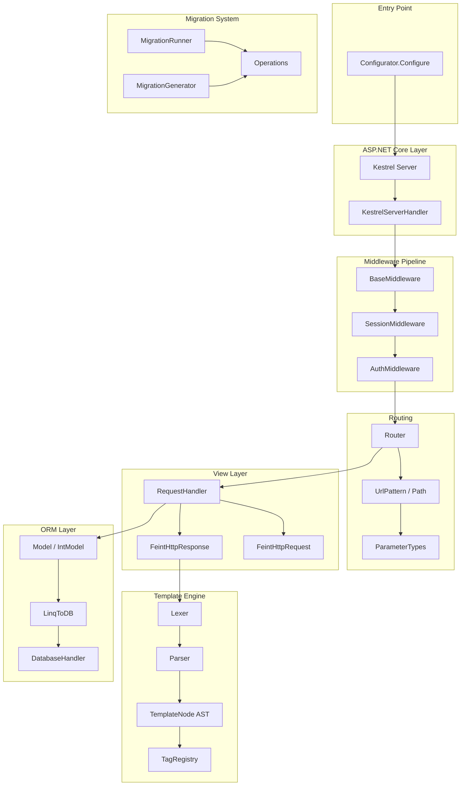

```
███████╗███████╗██╗███╗   ██╗████████╗
██╔════╝██╔════╝██║████╗  ██║╚══██╔══╝
█████╗  █████╗  ██║██╔██╗ ██║   ██║
██╔══╝  ██╔══╝  ██║██║╚██╗██║   ██║
██║     ███████╗██║██║ ╚████║   ██║
╚═╝     ╚══════╝╚═╝╚═╝  ╚═══╝   ╚═╝
███████╗██████╗  █████╗ ███╗   ███╗███████╗██╗    ██╗ ██████╗ ██████╗ ██╗  ██╗
██╔════╝██╔══██╗██╔══██╗████╗ ████║██╔════╝██║    ██║██╔═══██╗██╔══██╗██║ ██╔╝
█████╗  ██████╔╝███████║██╔████╔██║█████╗  ██║ █╗ ██║██║   ██║██████╔╝█████╔╝
██╔══╝  ██╔══██╗██╔══██║██║╚██╔╝██║██╔══╝  ██║███╗██║██║   ██║██╔══██╗██╔═██╗
██║     ██║  ██║██║  ██║██║ ╚═╝ ██║███████╗╚███╔███╔╝╚██████╔╝██║  ██║██║  ██╗
╚═╝     ╚═╝  ╚═╝╚═╝  ╚═╝╚═╝     ╚═╝╚══════╝ ╚══╝╚══╝  ╚═════╝ ╚═╝  ╚═╝╚═╝  ╚═╝
```

<div align="center">

**Django-inspired Web Framework for .NET**

[](https://dotnet.microsoft.com/)
[](https://docs.microsoft.com/en-us/dotnet/csharp/)
[](LICENSE)

[User Guide](docs/USER_GUIDE.md) · [Contributing](#contributing) · [Architecture](#architecture)

</div>

---

## Overview

FeintFramework is a Django-inspired web framework for .NET, implementing the Model-View-Template (MVT) pattern. This README is for **framework contributors and developers** who want to understand the internal architecture.

**For users building applications with FeintFramework, see [docs/USER_GUIDE.md](docs/USER_GUIDE.md).**

---

## Table of Contents

- [Architecture](#architecture)
- [Project Structure](#project-structure)
- [Core Modules](#core-modules)
- [Internal Components](#internal-components)
- [Development Setup](#development-setup)
- [Running Tests](#running-tests)
- [Contributing](#contributing)
- [Code Style](#code-style)
- [License](#license)

---

## Architecture



### Request Flow

1. **Kestrel** receives HTTP request
2. **KestrelServerHandler** (`Http/KestrelServerHandler.cs`) converts `HttpContext` to `FeintHttpRequest`
3. **Middleware Pipeline** processes request sequentially
4. **Router** (`Routing/Router.cs`) matches URL against patterns, extracts parameters
5. **View** (RequestHandler delegate) processes business logic
6. **Template Engine** renders response (if `FeintTemplateResponse`)
7. Response flows back through middleware chain

---

## Project Structure

```
src/
├── FeintFramework/                    # Core framework (main package)
│   ├── Config/
│   │   ├── Configurator.cs            # Application bootstrap, server setup
│   │   ├── HtmlWatcher.cs             # Hot reload for templates (debug mode)
│   │   └── Settings/
│   │       └── BaseSettings.cs        # Abstract settings class
│   │
│   ├── Routing/
│   │   ├── Router.cs                  # URL matching, reverse lookup
│   │   ├── UrlPattern.cs              # Pattern definition
│   │   ├── Path.cs                    # Pattern with typed parameters
│   │   ├── RootUrlPatterns.cs         # Base for app URL config
│   │   └── ParameterTypes/            # int, str, slug parsers
│   │
│   ├── Http/
│   │   ├── KestrelServerHandler.cs    # ASP.NET Core adapter
│   │   ├── FeintHttpRequest.cs        # Request wrapper
│   │   ├── FeintHttpResponse.cs       # Response base
│   │   ├── FeintTemplateResponse.cs   # Template rendering response
│   │   ├── FeintResponseRedirect.cs   # Redirect response
│   │   └── QueryDict.cs               # Multi-value parameter dict
│   │
│   ├── Templating/
│   │   ├── Lexer.cs                   # Tokenizer ({{ }}, , {# #})
│   │   ├── Parser.cs                  # Recursive descent parser
│   │   ├── TemplateLoader.cs          # File loading, caching
│   │   ├── TagRegistry.cs             # Custom tag registration
│   │   ├── Node/                      # AST node types
│   │   └── Tags/                      # Built-in tags (if, for, extends...)
│   │
│   ├── Forms/
│   │   ├── Form.cs                    # Base form with validation
│   │   ├── ModelForm.cs               # Auto-generated from models
│   │   ├── Fields/                    # CharFormField, PasswordFormField...
│   │   └── Widgets/                   # HTML input renderers
│   │
│   ├── Db/
│   │   ├── Model.cs                   # Base model classes
│   │   ├── Connections.cs             # Per-request connection management
│   │   └── Migrator/
│   │       ├── MigrationRunner.cs     # Execute migrations
│   │       ├── MigrationHelper.cs     # Reflection-based discovery
│   │       ├── DatabaseState.cs       # Current schema state
│   │       ├── Fields/                # CharField, IntegerField, ForeignKey...
│   │       └── Operations/            # CreateModel, AddField, AlterField...
│   │
│   ├── Middleware/
│   │   └── BaseMiddleware.cs          # Abstract middleware class
│   │
│   ├── Apps/
│   │   └── BaseApplication.cs         # Application module base
│   │
│   └── Shortcuts.cs                   # Helper functions (ReverseUrl, Redirect)
│
├── FeintFramework.Contrib/            # Built-in extensions
│   ├── Admin/                         # Auto-generated admin panel
│   │   ├── ModelAdmin.cs              # Admin configuration
│   │   ├── AdminHelpers.cs            # Registration, discovery
│   │   ├── AdminUrls.cs               # Admin URL patterns
│   │   └── templates/                 # Admin HTML templates
│   │
│   ├── Auth/                          # Authentication system
│   │   ├── AuthMiddleware.cs          # Load user from session
│   │   ├── Models/User.cs             # User model with password hashing
│   │   └── Backends/                  # Authentication backends
│   │
│   └── Sessions/                      # Session management
│       ├── SessionMiddleware.cs       # Cookie-based sessions
│       ├── SessionStore.cs            # Session data access
│       └── Models/Session.cs          # Database-backed session
│
├── FeintFramework.Db.Sqlite/          # SQLite database provider
│   └── SqliteDatabaseHandler.cs       # SQLite-specific SQL generation
│
├── FeintFramework.Db.MigrationGenerator/  # CLI tool
│   ├── MigrationGenerator.cs          # Compares models to DB, generates migrations
│   ├── SourceFileSearcher.cs          # Finds model source files
│   └── CodeGenerator.cs               # Roslyn-based C# code generation
│
└── FeintFramework.SourceGenerators/   # Compile-time code generation
    └── ObjectsGenerator.cs            # Generates static Objects property
```

---

## Core Modules

### FeintFramework (Core)

The main framework package containing all essential components.

#### Configurator (`Config/Configurator.cs`)

Application entry point. Responsibilities:
- Register template tags
- Create Kestrel web application
- Configure per-request database connections
- Set up middleware pipeline
- Start HTTP server on port 9000

```csharp
public static void Configure(string[] args)
{
    // 1. Register built-in template tags
    TagRegistry.Register("if", IfTag.ParseIfTag);
    TagRegistry.Register("for", ForTag.ParseForTag);
    // ...

    // 2. Create ASP.NET Core app with Kestrel
    var builder = WebApplication.CreateBuilder(args);
    builder.WebHost.ConfigureKestrel(options => {
        options.AllowSynchronousIO = true;  // Required for sync form handling
    });

    // 3. Set up request pipeline with per-request DB connection
    app.Use(async (context, next) => {
        using (var db = new DataConnection(...))
        {
            Connections.Connection = db;  // Thread-local connection
            serverHandler.HandleRequest(context);
        }
    });

    app.Run("http://0.0.0.0:9000");
}
```

#### Router (`Routing/Router.cs`)

URL pattern matching using regex with named groups.

Key methods:
- `HandleRequest()` - Match URL, extract parameters, call handler
- `Reverse()` - Generate URL from name and parameters
- `BuildFullUrlPatternList()` - Flatten nested URL patterns

Pattern compilation:
```csharp
// Pattern: "/post/<int:id>" becomes regex "^/post/(?<id>[0-9]+)$"
var regex = new Regex(url.Pattern, RegexOptions.Compiled);
var match = regex.Match(path);
var pathParams = regex.GetGroupNames()
    .ToDictionary(name => name, name => match.Groups[name].Value);
```

#### Template Engine (`Templating/`)

Django-like template compilation pipeline:

1. **Lexer** - Tokenizes template into Text, Variable, Block, Comment tokens
2. **Parser** - Builds AST using recursive descent
3. **Nodes** - Render themselves given a context dictionary
4. **TagRegistry** - Allows custom tag registration

Lexer token detection:
```csharp
TokensInfo = [
    new TokenInfo { TokenStart = "{{", TokenEnd = "}}", Type = TokenType.Variable },
    new TokenInfo { TokenStart = "", Type = TokenType.Block },
    new TokenInfo { TokenStart = "{#", TokenEnd = "#}", Type = TokenType.Comment },
];
```

#### Migration System (`Db/Migrator/`)

Schema management inspired by Django migrations.

Components:
- **MigrationRunner** - Executes pending migrations in dependency order
- **MigrationHelper** - Discovers models and migrations via reflection
- **DatabaseState** - Tracks current schema from applied migrations
- **Operations** - CreateModel, AddField, RemoveField, AlterField, RunSql

Migration dependency resolution uses QuikGraph for topological sorting.

---

### FeintFramework.Contrib

Built-in extensions that can be optionally included.

#### Admin (`Admin/`)

Auto-generated CRUD interface.

- **ModelAdmin<T>** - Configuration class for each model
- **AdminHelpers** - Discovers and registers model admins
- Uses reflection to generate forms from model fields
- Templates in `Admin/templates/`

#### Auth (`Auth/`)

Authentication system.

- **User** model with PBKDF2-SHA256 password hashing (260,000 iterations)
- **AuthMiddleware** - Loads user from session into request
- Password format: `pbkdf2_sha256$iterations$salt$hash`

#### Sessions (`Sessions/`)

Database-backed session management.

- **SessionMiddleware** - Creates/loads session, sets cookie
- **SessionStore** - Dictionary-like access to session data
- Sessions stored in `sessions_app_session` table

---

### FeintFramework.Db.MigrationGenerator

CLI tool for generating migrations.

Process:
1. Load settings and installed apps
2. Scan models via reflection
3. Compare to DatabaseState (from existing migrations)
4. Generate Operations for differences
5. Write C# migration files using Roslyn

```bash
dotnet run --project src/FeintFramework.Db.MigrationGenerator -- \
    --settings "Example.Core.Settings, Example" \
    --project "/path/to/Example"
```

---

## Internal Components

### Database Connection Management

Per-request connections via thread-local storage:

```csharp
// Configurator.cs
using (var db = new DataConnection(provider, connectionString))
{
    Connections.Connection = db;  // Set for this request
    try { handler(context); }
    finally { Connections.Connection = null; }
}

// Model usage
public void Save()
{
    var db = Connections.Connection;  // Get current connection
    db.Insert(this);
}
```

### Template Tag Registration

Extensible tag system:

```csharp
// Registration
TagRegistry.Register("mytag", MyTag.ParseMyTag);

// Tag handler signature
public delegate BaseNode TagParseHandler(Parser parser, Token token);

// Implementation
public static BaseNode ParseMyTag(Parser parser, Token token)
{
    // Parse tag content, consume tokens, build AST node
    return new MyTagNode(/* ... */);
}
```

### Form Field Discovery

ModelForm uses reflection to find model fields:

```csharp
var props = typeof(T).GetProperties(BindingFlags.Public | BindingFlags.Instance);
foreach (var prop in props)
{
    var fieldAttr = prop.GetCustomAttributes()
        .OfType<BaseField>()
        .FirstOrDefault();
    if (fieldAttr != null)
    {
        // Create form field from database field
        var formField = fieldAttr.FormField;
    }
}
```

---

## Development Setup

```bash
# Clone repository
git clone https://github.com/your-username/FeintFramework.git
cd FeintFramework

# Restore dependencies
dotnet restore

# Build all projects
dotnet build

# Run example application
dotnet run --project Example

# Server starts at http://localhost:9000
# Admin panel at http://localhost:9000/admin/
```

### VS Code Configuration

The repository includes `.vscode/` with:
- **Launch configs**: Debug Example, attach to process, run migration generator
- **Tasks**: Build solution

### Docker Development

```bash
docker compose up -d
docker compose exec app dotnet watch --project Example
```

---

## Running Tests

```bash
dotnet test
```

Test coverage:
- `tests/FeintFramework.Tests/Templating/` - Lexer, Parser, Tags
- `tests/FeintFramework.Tests/Routing/` - Router (partially commented)

---

## Contributing

### Pull Request Process

1. Fork the repository
2. Create a feature branch (`git checkout -b feature/my-feature`)
3. Make your changes
4. Add/update tests
5. Ensure tests pass (`dotnet test`)
6. Commit with descriptive message
7. Push and create Pull Request

### Areas for Contribution

- Additional database providers (PostgreSQL, MySQL)
- Async middleware support
- More template tags
- Form field types
- Test coverage
- Documentation

---

## Code Style

- Follow C# naming conventions (PascalCase for public, camelCase for private)
- Use nullable reference types (`#nullable enable`)
- XML documentation for public APIs
- Keep methods focused and small
- No magic numbers - use constants

### Project Conventions

- **Models**: Use `[Table]` attribute for table name, `partial class` for source generation
- **Migrations**: Auto-generated with `.g.cs` suffix
- **Templates**: Django-like syntax, stored in `templates/` directories
- **Apps**: One `App.cs` per module extending `BaseApplication`

---

## License

MIT License - see [LICENSE](LICENSE) file.

---

## Acknowledgments

- **[Django](https://djangoproject.com/)** - Architecture inspiration
- **[LinqToDB](https://linq2db.github.io/)** - ORM layer
- **[ASP.NET Core](https://docs.microsoft.com/en-us/aspnet/core/)** - Kestrel server
- **[Roslyn](https://github.com/dotnet/roslyn)** - Code generation
- **[QuikGraph](https://github.com/KeRNeLith/QuikGraph)** - Migration dependency resolution
